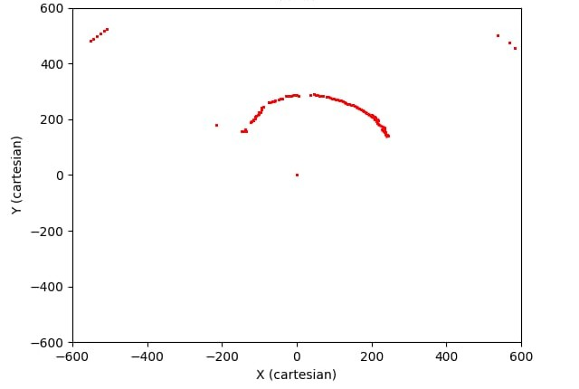
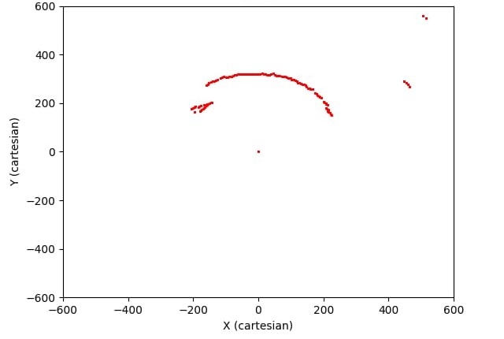

# 2D Sonar-Based Mapping System for AUV Localization

Utilizing the SEN0598 underwater ultrasonic sensor(df robotics ip68 underwater ultrasonic sensor (6m))

This project implements an **underwater mapping system** using **servo-mounted ultrasonic sensors** to generate **2D point clouds** for autonomous navigation.  

## How It Works  
1. **Sensor Configuration** – Ultrasonic sensors mounted on a **servo mechanism** scan the environment at different angles.  
2. **Data Processing** – Sensor readings are synchronized with servo positions to calculate **real-world obstacle coordinates**.  
3. **Mapping & Navigation** – Processed data is used to create a **2D map** for autonomous movement and **obstacle avoidance**.  

## Features  
- **Real-time** environment scanning using ultrasonic sensors  
- **Servo-based angle adjustments** for comprehensive mapping  
- **Noise filtering algorithms** for improved accuracy  

## Output Plots

